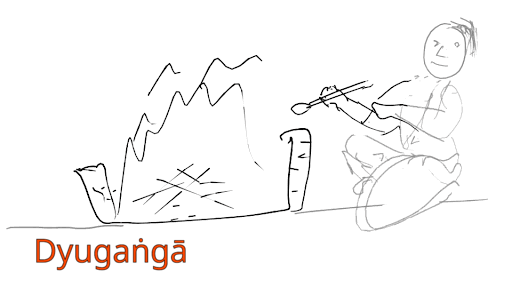

{title="Dyugangā banner"}

{title="Dyugangā logo" class="thumbnail"}

## Goals ध्येयानि
Dyugangā is a work group dedicated to the promotion of ever-victorious Hindu ideals and arts. It's current focus is in presenting important texts for easy study. Long term goal (https://rebrand.ly/dg-archive) is to save texts to last for millennia into the coming post-electronic/ industrial age.

The texts may be presented as 

- audio files (eg: [MahAbhArata audio book project](https://sanskrit.github.io/groups/dyuganga/projects/audio/mbh-audio/)), 
- as web pages (eg. [Apastamba-gRhya-sUtra](https://vishvasa.github.io/vedAH_yajuH/taittirIyam/sUtram/ApastambaH/gRhyam/sUtra-TIkAH/), [Apastamba-dharma-sUtra](https://vishvasa.github.io/vedAH_yajuH/taittirIyam/sUtram/ApastambaH/dharma-sUtram/sarva-prastutiH/), [EkAgnikANDa commentary](https://vishvasa.github.io/vedAH_yajuH/taittirIyam/sUtram/ApastambaH/gRhyam/ekAgnikANDam/sarva-prastutiH/), [manu-smRti](https://vishvasa.github.io/kalpAntaram/smRtiH/manuH/sarva-prastutiH/05/), [raghuvaMsha](https://vishvasa.github.io/kAvyam/laxyam/padyam/kAlidAsaH/raghuvaMsham/sarva-prastutiH/01/), more [kalpa-texts](https://sanskrit.github.io/groups/dyuganga//projects/text/proofreading/kalpa-texts/), [tattva-texts](https://sanskrit.github.io/groups/dyuganga//projects/text/proofreading/tattva-texts/), [universal subhAShita DB](https://subhashita.github.io/saMskRtam/padyam/random/)), 
- as dictionaries (eg: [stardict](https://sanskrit-coders.github.io/dictionaries/offline/stardict))
- ebooks distributed on various platforms - (eg: [vishvasa.github.io/book-pub](https://vishvasa.github.io/book-pub), amazon, google play - [SVK](https://play.google.com/store/books/series?id=EeyGHAAAABCW8M) [SVT](https://play.google.com/store/books/series?id=deyGHAAAABDy8M) [का](https://play.google.com/store/books/series?id=EuyGHAAAABCV8M)). Formats include md, pdf (A4, A5), epub, azw3, html, etc. 

We distribute these for free, and under a CC BY 4.0 license. (Platforms may levy their fees.) You may subscribe to mail-streams for past and future announcements ([dg](https://groups.google.com/g/dyuganga), [hv](https://groups.google.com/g/hindu-vidya/), [san](https://groups.google.com/g/samskrita)). 

The choice of material heavily depends on the special interests of its current lead (vedas, kalpa, purANa-s).

### संस्कृतानुवादः
द्युगङ्गा नाम कार्यसंस्था - अजेयानां भारतीयपुरुषार्थपरिकल्पनानाञ्च, हिन्दुककलानाञ्च प्रसारणाय वर्तते।  
तदीयस् स्थूलोद्देशोऽधुना प्रमुखग्रन्थानाम् अध्ययनसौकर्याय प्रस्तुतिः। ततो ग्रन्थ-सङ्कलन-केन्द्रम् इति वक्तुम् अलम्। दूरोद्देशस् तु (https://rebrand.ly/dg-archive) आधुनिक-शिला-तैल-युगात् परम् अपि सहस्राधिक-वर्षाणि यावद् ग्रन्थ-रक्षा।

ग्रन्थानाम् प्रस्तुतिर् ध्वनिसञ्चिकाभिस् स्यात् (यथा [महाभारतपारायणप्रसारणे](https://sanskrit.github.io/groups/dyuganga/projects/audio/mbh-audio/)), जाल-क्षेत्र-पृष्ठैर् वा (यथा [विश्वासस्य मन्त्रटिप्पनीषु](https://vishvasa.github.io/vedAH_sAma/paravastu-saama/devaH/agniH/mahAvaishvAnara-vratam/), [एकाग्निकाण्डटीका](https://vishvasa.github.io/vedAH_yajuH/taittirIyam/sUtram/ApastambaH/gRhyam/ekAgnikANDam/sarva-prastutiH/1_01a/)), शब्द-कोशैर् वाऽपि ([stardict](https://sanskrit-coders.github.io/dictionaries/offline/stardict))। इमे ऽस्मत्-पक्षतो मुक्त-रीत्या प्रसार्यन्ते। सद्यश्च ग्रन्थाः संस्थाग्रण्या रुचिविशेषम् अनुसृत्य चिताः - वेदाः, इतिहास-पुराणानि, कल्प-वेदाङ्ग-ग्रन्थाश् चेति।

### Contribution, contact
अस्मत्-सम्पर्कः - @gmail - vishvas.vasuki, ९५९१२ ६८५०६ (see [contact page on our website](https://sanskrit.github.io/groups/dyuganga/contact/))। Serious volunteering, donations and sponsorship are welcome  - they help offset operating costs (eg. worker payments, book distribution) and plan further projects. Project-specific sponsorship opportunities are occasionally advertised on our social media accounts and on certain mailing lists.

## वन्दनीय-वन्दना
(अनेनोद्यमेन नैषां महतां साक्षात् सम्बन्ध ऊह्यः ।)

 

इञ्जिमेडु-यति-सिंह-**रक्षितो**  
राजगोप--बुध-गोप-**चारितः**।  
सिंह-लक्ष्म-नर-नाम-भाग् **बभौ**  
दिव्य-सूक्ति-वन-मार्ग-**नायकः**॥

यद्-आचार-स्वभावाभ्यां  
"ज्ञेयम् अस्त्य् अत्र वैष्णवे"।  
इति निष्कर्ष-जिज्ञासे,  
**नौमि** तं श्री-नृसिंहकम्॥

  
