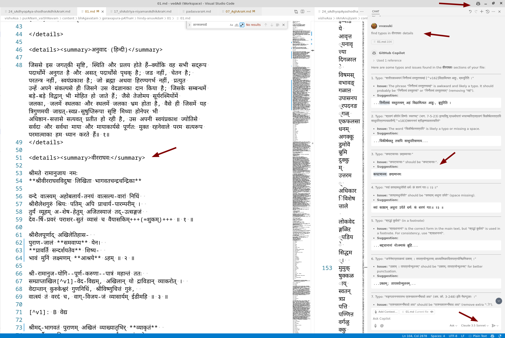

+++
title = "AI help"
+++
You can take the help of AI for proofreading. 

General strategy - 

Use one AI to OCR, another judge LLM to proofread.

## Web interface
See separate [page](../AI-prompt). 

## Inside editor
See images [here](/groups/dyuganga/projects/text/proofreading/images/AI) to get ideas.

You can get this assistance from within the Vscode or Intellij editor.

{title="" class="thumbnail"}

## Use cases
kArttika uses LLMs to go from a pdf scan to formatted text. 8 hours per the entire chandamama issue of 50-60 pages. ("I was spending 40+ hours when it was tesseract-based. So, 2-3 stories a week, max.")

